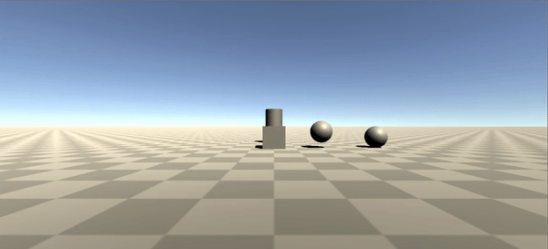

## Practica 3

**Realización:**

Se ha añadido un cubo, dos esferas y un cilindro a la escena. El cubo se mueve mediante las fechas de dirección o WASD gracias al uso del script [movement.cs](Scripts/movement.cs) . Una de las esferas se mantiene fija en la escena y la otra rota aleatoriamente por la misma, para esto se ha usado el script [randomMovement.cs](Scripts/randomMovement.cs) . El movimiento del cilindro se controla mediante las teclas IJKL haciendo uso del script [IJKLMovement.cs](Scripts/IJKLMovement.cs) . Todos los objetos cuentan con un detector de colisiones que pone el objeto rojo al entrar la colision, azul cuando se matiene y blanco cuando esta termina, gracias al script coliisionDetector.cs . Además el cubo cuenta las colisiones que ha tenido e imprime por la consola este contador, haciendo uso del script [collisonCounter.cs](Scripts/collisionCounter.cs)

**GiF:**

